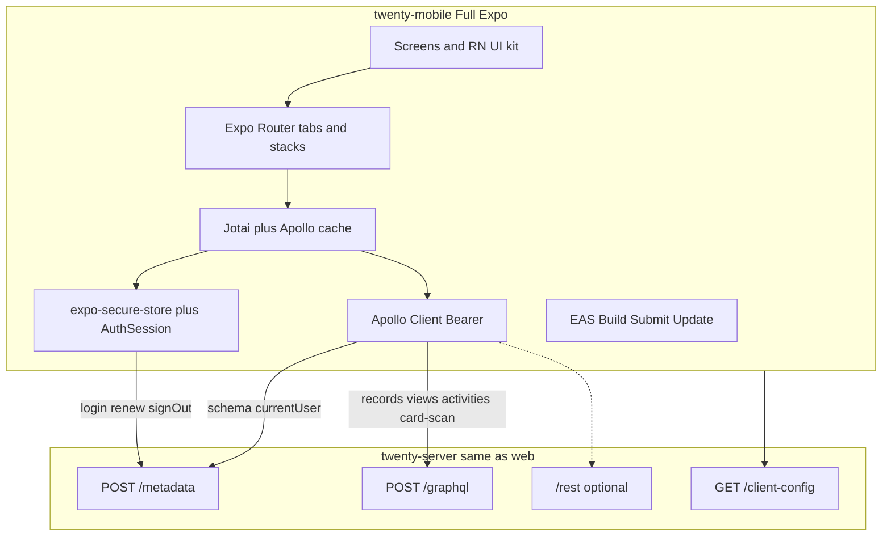
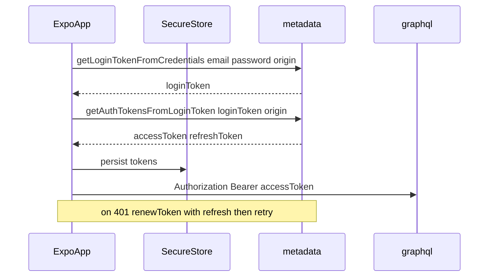

# Twenty Mobile — Architecture and Delivery Phases

Full architecture and phased delivery plan for `packages/twenty-mobile`: a **full Expo** (managed) native client against the same `twenty-server` as web, with metadata-driven CRM parity, Twenty-token-based native UI, and Bearer JWT auth.

| | |
|---|---|
| **Live API** | [https://crm.arcloops.io](https://crm.arcloops.io) |
| **Package** | `packages/twenty-mobile` |
| **Related** | [README.md](./README.md) (auth + API quickstart) |

---

## Table of contents

1. [Current state](#current-state)
2. [Locked decisions](#locked-decisions) (includes [Full Expo](#full-expo-locked))
3. [System architecture](#system-architecture)
4. [Auth sequence](#auth-sequence-password)
5. [Package layout](#layered-package-layout-target)
6. [UI design system](#ui-design-system-native-twenty-faithful)
7. [Feature map (web → mobile)](#data--feature-map-web--mobile)
8. [Delivery phases](#delivery-phases)
9. [Web-only exceptions](#explicit-web-only-or-web-first-exceptions)
10. [Infra and monorepo notes](#infra-and-monorepo-notes)
11. [Phase checklist](#phase-checklist)
12. [Next step](#suggested-immediate-next-step)

---

## Current state

`packages/twenty-mobile` is a full Expo (managed) app with password + Microsoft/Google AuthSession sign-in, connected accounts, metadata-driven CRM, saved views, attachments, activities, business-card People scan, read-only admin settings (API keys / roles / billing), KPI dashboards, workflow runs, and EAS/Maestro store-release scaffolding.

The web app already encodes the mobile product shape:

| Concept | Location |
|---------|----------|
| Mobile home (`/home`) | [`AppPath.Home`](../twenty-shared/src/types/AppPath.ts), [`MobileHomePage`](../twenty-front/src/pages/mobile-home/MobileHomePage.tsx) |
| Bottom bar | Home / Search / People (and other CRM tabs) |
| Record list | `/objects/:objectNamePlural` |
| Record detail | `/object/:objectNameSingular/:objectRecordId` |

The native app implements that same product model against the **same** `twenty-server` APIs. It does **not** need a separate backend.

---

## Locked decisions

| Decision | Choice |
|----------|--------|
| **Stack** | **Full Expo** — managed workflow end-to-end (see below) |
| **API** | Same host (`https://crm.arcloops.io` / local `:3000`); `/metadata` for auth + schema; `/graphql` for records |
| **Auth** | Bearer access + refresh JWTs in `expo-secure-store` (never cookies) |
| **CRM model** | Metadata-driven generic object list/detail (same as web `object-record` + `views`), not hardcoded People/Company screens |
| **UI** | Native React Native design system ported from [`twenty-ui` theme tokens](../twenty-ui/src/theme/constants) — not Linaria, not WebView, not reuse of web components |
| **Shared code** | `twenty-shared` utils/types only; optional `twenty-client-sdk` for REST; do not import `twenty-front` UI |
| **Parity goal** | Full field-user feature set from web, then admin surfaces; each phase ships usable product |

### Full Expo (locked)

We stay inside the Expo platform for the whole app lifecycle. No bare React Native eject, no custom `android/` / `ios/` trees checked in unless Expo prebuild generates them for EAS.

| Area | Expo choice |
|------|-------------|
| **Workflow** | Expo managed (CNG / Continuous Native Generation) |
| **Routing** | Expo Router (file-based) |
| **Language** | TypeScript |
| **Platforms** | iOS + Android (same codebase) |
| **Dev** | Expo Go for early UI; **Expo Dev Client** when native modules need it (SecureStore, AuthSession, etc.) |
| **Native APIs** | Prefer Expo SDK modules first (`expo-secure-store`, `expo-auth-session`, `expo-linking`, `expo-file-system`, `expo-notifications`, `expo-image-picker`, …) |
| **Config** | `app.json` / `app.config.ts` + Expo config plugins — not hand-edited native projects |
| **Build & submit** | **EAS Build** + **EAS Submit** (Phase 8); no local Xcode/Android Studio release pipeline as the primary path |
| **Updates** | EAS Update when we need OTA JS updates after store release |
| **Out of scope** | Bare RN CLI app, Flutter, Capacitor/WebView shell, ejecting to maintain native folders |

If a library requires custom native code, wrap it with an **Expo config plugin** or an Expo module — do not abandon the managed workflow.

---

## System architecture



### Client vs web auth

| Client | Host | Auth style |
|--------|------|------------|
| `twenty-front` (web) | same | HttpOnly session cookies |
| `twenty-mobile` (Expo) | same | `Authorization: Bearer <JWT>` |

Do not copy the web Apollo setup (`credentials: 'include'` only). Native clients must store and send JWTs.

### API paths

| Purpose | Path |
|---------|------|
| Auth + metadata GraphQL | `/metadata` |
| Core / records GraphQL | `/graphql` |
| Core REST | `/rest/` |
| Metadata REST | `/rest/metadata/` |
| Public config | `GET /client-config` |

---

## Auth sequence (password)



### Rules

1. `getLoginTokenFromCredentials(email, password, origin)` on `/metadata`
2. `getAuthTokensFromLoginToken(loginToken, origin)` → access + refresh tokens
3. Store both in **Expo SecureStore**
4. Send `Authorization: Bearer <accessToken>` on every request
5. Before expiry (or on 401), call `renewToken(appToken: refreshToken)` and retry
6. Pass `origin: 'https://crm.arcloops.io'` — must match the workspace URL
7. Workspace is encoded in the JWT — there is **no** `x-workspace-id` header

Microsoft / Google use Expo AuthSession + deep link redirect URIs registered in Azure/Google (separate from web localhost callbacks).

Server references:

- Auth resolver: [`auth.resolver.ts`](../twenty-server/src/engine/core-modules/auth/auth.resolver.ts)
- Web auth (comparison only): [`useAuth.ts`](../twenty-front/src/modules/auth/hooks/useAuth.ts)

---

## Layered package layout (target)

```
packages/twenty-mobile/
  app/                      # Expo Router routes
    (auth)/                 # welcome, verify, reset
    (app)/                  # authenticated shell
      home.tsx              # mirrors web MobileHomePage
      objects/[plural].tsx  # record index
      object/[singular]/[id].tsx
      chat/[threadId]?.tsx
      settings/...
      search.tsx
  src/
    api/                    # Apollo clients metadata + core, links
    auth/                   # login, renew, SecureStore, Microsoft session
    metadata/               # object/field schema cache
    records/                # generic list, detail, mutations
    views/                  # filters sorts view types
    activities/             # timeline tasks notes emails files
    ai/                     # chat threads streaming
    navigation/             # menu items from workspace config
    settings/               # profile accounts experience
    ui/                     # RN kit: tokens, Button, ListRow, Field*, Sheet
    i18n/                   # Lingui (align with monorepo)
  .env                      # EXPO_PUBLIC_TWENTY_API_URL
  ARCHITECTURE.md           # this document
  README.md                 # auth + API quickstart
```

---

## UI design system (native, Twenty-faithful)

Port tokens from `twenty-ui` (colors, spacing scale, radii, typography, light/dark) into an RN `ThemeProvider`. Build a small kit used everywhere.

| Web concept | Mobile equivalent |
|-------------|-------------------|
| Navigation drawer + `/home` | Home tab = full nav menu page ([`MobileHomePage`](../twenty-front/src/pages/mobile-home/MobileHomePage.tsx)) |
| Bottom bar Home / Search / CRM objects | Expo tabs for Home, Search, and core objects |
| Record index (table/kanban/list) | Phase 1: LIST; later KANBAN / CALENDAR |
| Record show (page-layout widgets) | Scroll stack of field card + widget sections |
| Side panel search / actions | Full-screen Search + action sheets |
| Cmd-K | Search + record actions menu |

### Visual rules

- Match Twenty spacing and neutrals
- Large tap targets and safe areas
- No web card chrome clutter on phone
- Dark mode from day one via the same token pairs
- Import icons conceptually from Twenty’s icon dictionary; use RN-compatible icon components (not `@tabler/icons-react` directly in the web sense)

---

## Data / feature map (web → mobile)

| Domain | Web source | Mobile approach |
|--------|------------|-----------------|
| Auth | `modules/auth`, `/metadata` | SecureStore + Apollo auth link |
| Objects | `object-metadata` + `object-record` | Generic routes only |
| Views | `modules/views` | Load saved views; filters/sorts UI |
| Activities | `modules/activities` + record widgets | Sections on record show |
| Business card scan | People record index action | Document pick → OCR extract → create Person |
| Nav | `navigation-menu-item` | Drive Home menu from API |
| Settings | `SettingsPath` user vs admin | Profile first; admin later |
| Workflows / dashboards | nav + page-layout | Read/run after CRM core |
| Accounts email/calendar | Settings → Accounts | Connect + widgets after Microsoft auth |

---

## Delivery phases

Each phase ends with a demoable build on device/simulator against `https://crm.arcloops.io`.

### Phase 0 — Foundation (scaffold + design + auth password)

**Goal:** bootable **full Expo** app with password login and an authenticated shell.

- Scaffold with `create-expo-app` / Expo Router template inside `packages/twenty-mobile` (TypeScript, ESLint/Prettier aligned with monorepo)
- Config via `app.config.ts` only (managed workflow); no checked-in bare `ios/` / `android/`
- Env: `EXPO_PUBLIC_TWENTY_API_URL`
- RN UI kit v1: theme tokens, Button, TextInput, Screen, ListRow, EmptyState, Spinner
- Auth: login screen, `getLoginTokenFromCredentials` → `getAuthTokensFromLoginToken`, `expo-secure-store`, `renewToken` interceptor, sign-out
- Route guards: `(auth)` vs `(app)` via Expo Router groups
- Sanity: authenticated `currentUser` / client-config; runs on iOS Simulator / Android Emulator via Expo

**Exit criteria:** sign in with email/password, see authenticated home shell, token refresh works.

---

### Phase 1 — CRM core (metadata-driven list + detail + edit)

**Goal:** generic CRM on phone for any workspace object.

- Fetch object metadata; render Home nav from workspace navigation menu items
- Record index: LIST view for any object (People, Companies, Opportunities, custom)
- Record show: identity + field renderer by field type (text, number, date, select, relation, links, emails, phones)
- Create / update / soft-delete records
- Global Search (record search) as tab
- Bottom tabs: Home / Search / CRM objects

**Exit criteria:** browse any object, open a record, edit fields, create a company/person — parity with web’s core object UX on phone.

---

### Phase 2 — Views and richer index

**Goal:** saved views and pipeline-style browsing.

- Saved views switcher; filters and sorts
- Kanban for Opportunities (and any kanban-enabled object)
- Relation field navigation (open related record)
- Attachments / files upload-download on record
- Pull-to-refresh, pagination / infinite scroll

**Exit criteria:** switch views, filter pipeline, open relations — matches web list power without desktop table density.

---

### Phase 3 — Activities on records

**Goal:** day-to-day CRM work without opening web.

- Timeline widget
- Tasks and Notes sections (create/complete/edit)
- Email threads (read) and Calendar events (read) when accounts connected
- Compose note/task from record action sheet

**Exit criteria:** work a record’s timeline, tasks, and notes fully on mobile.

---

### Phase 4 — Microsoft (and Google) sign-in + connected accounts

**Goal:** Arcloops SSO and synced mail/calendar.

- `expo-auth-session` + `expo-linking` deep links for Microsoft (required for Arcloops) and Google
- Register mobile redirect URIs in Azure / Google consoles (scheme from `app.config.ts`)
- Use Expo Dev Client if AuthSession / secure storage need custom native builds
- Settings → Profile + Accounts: connect email/calendar providers
- Wire messaging/calendar widgets to live data

**Exit criteria:** users can sign in with Microsoft and see synced mail/calendar on records.

---

### Phase 5 — Business card scan

**Goal:** Capture contacts from card photos on People.

- People list header Scan action
- Document/image pick → upload → server OCR extract → review → create Person

**Exit criteria:** scan a card image and create a Person with extracted fields.

---

### Phase 6 — Settings (field user) + polish chrome

**Goal:** self-serve account management.

- Profile, Experience (theme, locale), Accounts
- Workspace members (view), invite link if permitted
- Information banners, localization (Lingui), dark mode QA
- Deep links: `twenty://object/...` open record

**Exit criteria:** profile and accounts managed without admin complexity.

**Status:** Done. Slim Lingui covers settings hub, login CTAs, and chrome banners (`en` + `fr`); full-app catalogs deferred.

---

### Phase 7 — Dashboards, workflows, advanced CRM

**Goal:** power-user monitoring from phone.

- Dashboard page layouts (AGGREGATE KPI widgets with filters/tabs; charts stay web)
- Workflows: list runs, trigger/manual run where API allows; builder remains web-first
- Spreadsheet import: defer or open web; not a mobile priority
- Offline cache for recent records (read-mostly) — **no** mutation queue this phase
- Push notifications deferred until device-token API (Phase 8+)

**Exit criteria:** monitor pipelines and workflow runs from phone.

**Status:** Done (MVP). Charts / GRAPH widgets and push notifications deferred.

---

### Phase 8 — Admin surfaces + store release

**Goal:** production store builds and documented boundaries.

- Subset of workspace settings: members/roles view, API keys display (create on web), billing status
- Full data-model editor stays web-first (too dense for phone); deep-link to web if needed
- **EAS Build** (iOS + Android) + **EAS Submit**; icons/splash/privacy via Expo config
- Optional **EAS Update** for OTA JS patches (add `expo-updates` + `channel` in `eas.json` when enabling OTA)
- Crash reporting (Sentry Expo plugin if used)
- E2E smoke (Maestro preferred with Expo; or Detox): login → list → detail → edit

**Exit criteria:** production store builds via EAS; documented web-only exceptions.

**Status:** Done (MVP). EAS project id / store credentials are out-of-band (`eas init` + Apple/Google accounts). Charts/push remain deferred.

---

## Explicit web-only (or web-first) exceptions

These stay out of early mobile or remain permanently better on web — **store-facing list**:

- Data model / field schema builder, spreadsheet import wizard
- Full workflow graph builder
- Dense TABLE view with dozens of columns (mobile uses LIST + detail)
- Admin Panel / impersonation
- Marketplace app developer tooling
- GRAPH / chart widgets (mobile shows AGGREGATE KPIs only; open on web for charts)
- Push notifications until a device-token registration API exists
- Offline optimistic write / mutation queue (mobile is read-cache only for now)
- API key create/revoke and role assignment edits (mobile is read-only + “Manage on web”)

---

## Infra and monorepo notes

| Topic | Guidance |
|-------|----------|
| **Expo** | Full managed workflow; Expo SDK modules first; EAS for build/submit/update |
| **Nx** | Wire targets later (`start`, `test`, `lint`); `npx expo start` loop first |
| **Captcha** | Password login uses `CaptchaGuard` on server — decide mobile strategy (config bypass for trusted clients, or integrate captcha) |
| **Proxy** | `/graphql`, `/metadata`, `/client-config` must hit the server (not SPA HTML) |
| **Secrets** | Never in the Expo bundle; only `EXPO_PUBLIC_*` base URL |
| **twenty-shared** | Safe for isomorphic utils (`isDefined`, `AppPath`, etc.) |
| **twenty-client-sdk** | Optional typed REST/GraphQL helpers |
| **twenty-ui / twenty-front** | Web-only — do not import as-is |

### Sanity checks before coding screens

```bash
# Should return JSON (not the SPA HTML)
curl -sS https://crm.arcloops.io/client-config | head

# With an API key from Settings → API & Webhooks
curl -sS -X POST https://crm.arcloops.io/graphql \
  -H "Authorization: Bearer YOUR_API_KEY" \
  -H "Content-Type: application/json" \
  -d '{"query":"{ companies(first: 3) { edges { node { id name } } } }"}'
```

---

## Phase checklist

| Phase | Name | Status |
|-------|------|--------|
| 0 | Foundation — full Expo scaffold, theme, password JWT, Home shell | Done |
| 1 | CRM core — list, detail, create/edit, Search | Done |
| 2 | Views — filters, sorts, kanban, relations, files | Done |
| 3 | Activities — timeline, tasks, notes, email/calendar read | Done |
| 4 | Microsoft/Google AuthSession + connected accounts | Done |
| 5 | Business card People scan | Done |
| 6 | Profile / Experience / Accounts + deep links | Done |
| 7 | Dashboards, workflow runs, offline (read cache) | Done (MVP) |
| 8 | Admin subset + EAS store release + E2E smoke | Done (MVP) |

---

## Suggested immediate next step

Phases **0–8** are implemented (store path ready; run `eas init` + credentials locally for real binaries). Follow-ups: charts/GRAPH widgets, push device tokens, offline write queue.

Run the app:

```bash
yarn workspace twenty-mobile start
```

If AuthSession / NetInfo packages are missing after a clean clone:

```bash
yarn workspace twenty-mobile add expo-web-browser expo-auth-session expo-crypto expo-application @lingui/core @lingui/react @react-native-community/netinfo
```

Vendor tarballs / extracted packages under `packages/twenty-mobile/vendor/` (including NetInfo at `vendor/netinfo`) can be used when the registry is unreachable (`portal:./vendor/netinfo` in `package.json`).
